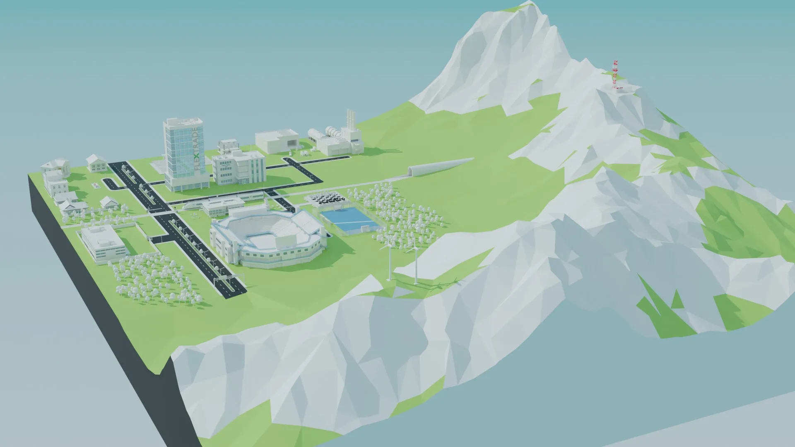

# Three.js Portfolio Website

## Motivation & Goals
I had been working primarily with traditional 2D interfaces, but once I saw what was possible with 3D on the web, I was hooked. The main goal of this project was to create an immersive, layered experience that blends a functional UI with interactive 3D elements.

I wanted users to feel like they were stepping into something, not just clicking through it. My work always felt like it was missing another dimension (no pun intended), and this project was my way of pushing past those flat boundaries and experimenting with space, depth, and interaction in a more dynamic way.

## Core Features

### Interactive 3D Model
The 3D cityscape at the heart of this site was built in Blender, designed to reflect different parts of my life and portfolio. Each area corresponds to a theme or experience, making navigation feel more like exploration. There’s a stock trading office to represent my fintech career, a chess park for one of my favorite hobbies, and an animated train that moves through the city, serving as a lighthearted way to bring guests from the web into this digital world.

### Glassmorphic UI
Layered on top of the city is a glassmorphic UI built with over 100 custom React components. These elements give users more context without overwhelming the experience. Fully modeling the interface in 3D would have made it hard to absorb the content, so the transparent glass effect lets users stay connected to the city while interacting with information.

### Backend Integration
The site connects to an Express.js server that streams live data about my chess activity, favorite sports team, and GitHub activity. If the activity card to the right is blinking green, all systems are live. If not, maybe the backend is just running on my imagination. Either way, pulling in live data helped bring the city to life in a dynamic and personal way.

## Tech Stack

#### Core Technologies
* **Three.js**: The core of this entire project, powering the immersive 3D environment.
* **React**: Used to structure the portfolio as a component-based app, managing state and syncing with 3D elements.
* **TailwindCSS**: Sped up the styling process and kept styles scoped inside components for a clean, consistent UI.
* **Storybook**: Allowed me to isolate and preview each UI component, speeding up development and keeping things focused.

#### Other Tools, Libraries and Tech
* **Adobe After Effects**: Created motion graphics and visual effects, like the stock ticker on the trading office.
* **Blender**: Built and optimized 3D models and environments, including asset compression and LOD systems.
* **Theatre.js**: Used for complex animations and cinematic sequences within the 3D environment.
* **Canva**: My go-to for graphic design and UI prototyping. I meant to switch to Figma, but Canva was just too familiar and fast.

## Reflection

### Biggest Challenge
The hardest part was building two worlds: a 3D experience and a 2D interface, and making them feel like one cohesive project. At times, it genuinely felt like I was working on two completely different apps that were refusing to get along. Managing the state between the 3D scene and the React UI was especially exhausting, but somewhere in the chaos, it became a fun challenge. It forced me to rethink my initial ideas constantly and dive deep into creative problem-solving.

### Lessons Learned
Yes, I picked up new frameworks, tools, and UI/UX design skills. But honestly, the biggest lesson was about project management. I thought I could finish this entire project in three months. I even taped a plan to my wall (you’ll find it below so feel free to laugh). The problem? I never clearly defined what “done” actually looked like. That led me to keep adding features, expanding the scope, and slowly burying myself under an ever-growing backlog. I nearly gave up more than once.

### What I’d Do Differently
Next time, I’d start with a full end-to-end prototype, something rough but complete, just to outline the vision from the start. Instead, I kept building in isolated parts, constantly refactoring or fixing things that never made it into the final site. I even wanted to change core features midway through but was already too deep to pivot easily. That cost me time I’ll never get back, but hey, you live and you learn.

## Summary
This project was an experiment in merging worlds: 2D and 3D, art and engineering, ambition and reality. It didn’t go according to plan, but the lessons learned were worth it.
